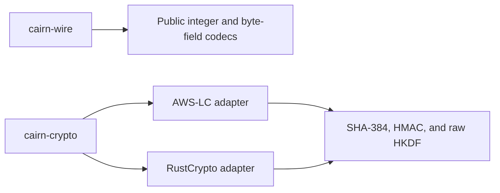

# Cairn

Experimental post-quantum peer-to-peer messaging over Bluetooth Low Energy.

Cairn aims to let nearby **peers** pair, become **contacts**, and exchange
encrypted messages over ordinary BLE connections without Bluetooth bonding.
The draft uses a post-quantum exchange during pairing and a smaller exchange
on later connections. Its ratchet refreshes post-quantum keys over time.

**This is a research project and an unreleased Rust foundation, not a working
messaging SDK. Do not use it to protect production data.** The protocol is
still a draft. Formal verification, mobile runtime validation, and independent
cryptographic review are incomplete.

## What exists today

| Available | Not implemented |
|---|---|
| Protocol specification, threat model, and design decisions | A secure-channel implementation |
| Tamarin models, proof certificates and Lean lifecycle evidence | Pairing, Resume and ratchet state machines in Rust |
| Canonical public wire codecs in `cairn-wire` | KEM, AEAD and protocol-labelled crypto glue |
| SHA-384, HMAC, and raw HKDF through AWS-LC and RustCrypto | Kotlin bindings, BLE adapters, and the chat app |
| Conformance, fuzz, host taint and mobile compilation checks | Device execution and mobile constant-time evidence |

The prototype targets Android API 26+ and iOS 15+ for Android-to-Android and
Android-to-iOS communication. The Rust libraries compile for those platforms,
but no app or device test establishes runtime support.

The current crates provide these functions. The arrows show dependencies,
not a working messaging flow.



## Start here

- [Encode and decode your first public field](docs/tutorials/first-wire-roundtrip.md)
  with the Rust codec.
- [Validate the Rust foundation](docs/how-to/validate-foundation.md) before
  changing it.
- [Understand the compact post-quantum design](docs/explanation/compact-pqc-over-ble.md)
  and its tradeoffs.
- [Browse the documentation](docs/README.md) for API details, the protocol
  specification and verification evidence.

## Repository

```text
core/          Wire and partial crypto libraries, with internal test harnesses
docs/spec/     Draft protocol, threat model and formal models
docs/adr/      Accepted design decisions and their limitations
docs/research/ Dated investigations, not normative protocol definitions
scripts/       Local validation commands
```

The planned `sdk/` and `app/` modules do not exist yet. See
[PROJECT.md](PROJECT.md) for the verified build profile and current evidence,
and [GLOSSARY.md](GLOSSARY.md) for protocol terms. Contributor rules live
in [AGENTS.md](AGENTS.md) and [CONSTITUTION.md](CONSTITUTION.md).

## License

Cairn's own code is released under the [Unlicense](LICENSE). Dependencies and
vendored test data retain their own licenses and notices. See the
[foundation dependency reference](core/README.md#dependencies-and-vectors).
