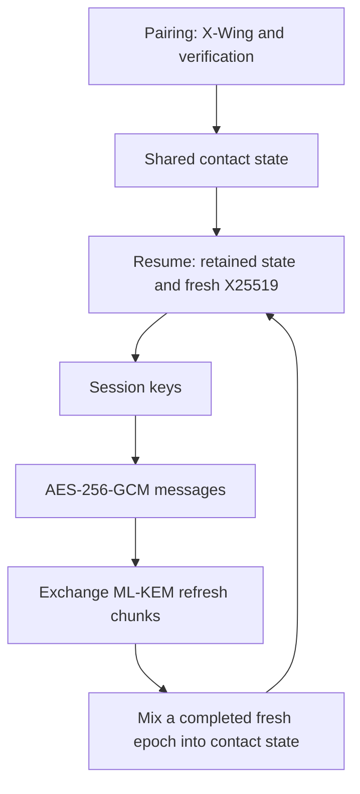

# Why compact post-quantum messaging over BLE needs a hybrid design

Cairn keeps ordinary messages small by separating message encryption from
the larger post-quantum key exchanges. Later connections depend on secrets
that the contacts already share.

## Large exchanges and small messages solve different problems

In the draft suite, ML-KEM-768 has a 1,184-byte public key and a
1,088-byte ciphertext. The hybrid X-Wing exchange is larger still:
a 1,216-byte public key and a 1,120-byte ciphertext. These established
algorithms determine much of the initial payload. Changing a serialization
library cannot remove that cryptographic material.

BLE does not require each logical exchange to fit in one radio packet.
Cairn's [transport design](../adr/0003-ble-transport.md) uses fragmentation
and a mandatory GATT path, with L2CAP CoC as an optional upgrade. Larger
exchanges cost airtime, energy, and completion time even when fragmentation
makes them possible.

## Pay different costs at different points

The [draft protocol](../spec/cairn-r1.md) separates three stages. This diagram
shows the planned protocol, not the current Rust implementation.

Each stage has a different role:

- **Pairing** establishes the contact relationship using X-Wing and a
  verification method such as QR or SAS.
- **Resume** derives a session on later connections using existing contact
  state and a fresh X25519 exchange. Its draft messages are 57 and 49 bytes.
- **Data and ratcheting** use symmetric encryption for messages and transport
  ML-KEM refresh material over time, including chunks carried in padding.

A short Resume is not a fresh standalone post-quantum exchange.
Resume depends on retained state and completed post-quantum epochs.
Recovery after compromise requires a fresh, honestly exchanged epoch whose
secrets remain unexposed. An attacker who keeps intercepting exchanges can
prevent that recovery. The [threat model](../spec/threat-model.md) and
specification describe these conditions.

A full KEM exchange on every connection supplies fresh post-quantum material
immediately, but sends substantially more bytes each time. Never refreshing
post-quantum state saves traffic but loses the intended recovery mechanism.
Cairn's draft chooses periodic refreshes. The smaller Resume is useful only
if the protocol preserves the state and recovery conditions that justify it.

## Compactness is not the only constraint

The design uses AES-256-GCM with a 16-byte tag rather than choosing a cipher
only for its smallest possible packet. Approved algorithms, authentication,
replay handling, padding, and recovery all constrain the byte budget.
The [suite decision](../adr/0001-crypto-suite.md) explains that choice.
An approved algorithm is not a claim that Cairn is a validated FIPS module.

An ordinary BLE connection provides transport, not Cairn's security
boundary. Cairn pairing is distinct from operating-system Bluetooth pairing
and bonding. The planned Kotlin code owns BLE, timers, and storage.
The planned Rust core owns protocol state and crypto decisions without
performing network or storage I/O. This boundary is called **sans-IO**.

## Why the implementation starts small

The current foundation implements public wire fields and a partial
SHA-384, HMAC, and HKDF interface, not these protocol stages. Two adapters make
independent conformance and differential checking possible before state
machines depend on them.

The [bounded foundation decision](../adr/0012-rust-foundation-increment.md)
keeps this work separate from bindings and the composed-ratchet gate.
Formal models describe symbolic protocol behavior. Host taint checks test
selected compiled paths for branches or memory accesses that depend on
secrets. Cross-builds establish that code compiles for a target.
These checks answer different questions. None proves that the complete
mobile protocol is secure.
