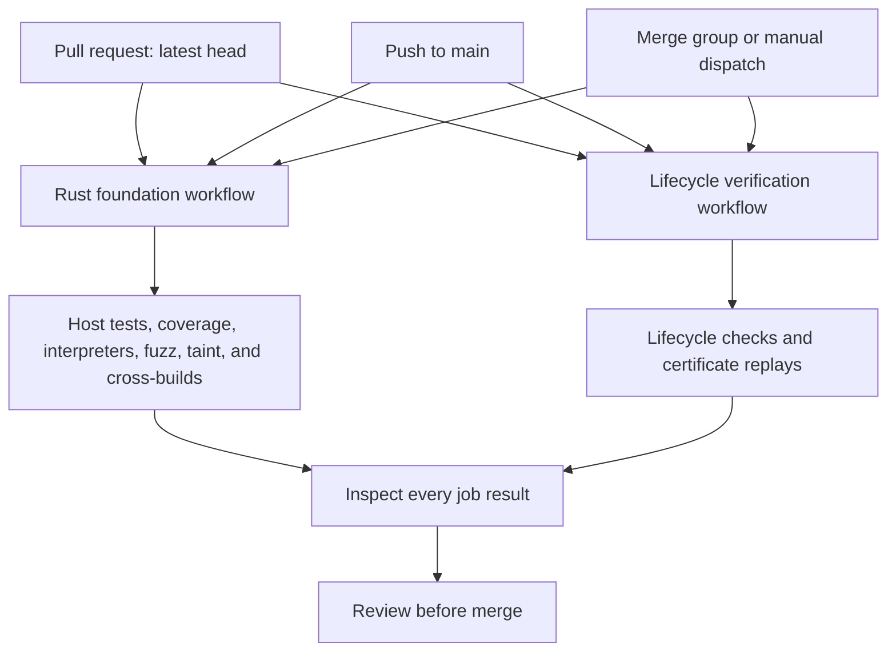

# Validate the Rust foundation before submitting a change

Use this guide when changing `core/`, its test data or the Rust CI workflow.
Run the local checks below, then select extra checks for the changed code.
The local checks do not replace the full hosted CI matrix.

## Run the local checks

From the repository root, with `rustup` installed and initial network access
for dependency and tool downloads:

```sh
rustup show active-toolchain
cargo install cargo-deny --version 0.20.2 --locked
bash scripts/check-rust.sh
```

The root toolchain file selects Rust `1.99.0`. The script checks formatting
in the main, fuzz, and taint workspaces. It runs clippy and tests with both
adapters, then tests each adapter separately. It also audits all three
dependency workspaces with `cargo-deny`.

Exit status zero means the script passed. If a check fails, fix the reported
error and rerun the script. If a native compiler or SDK is missing, install
the prerequisite rather than disabling an adapter. Record the exact error
if your environment cannot run a check.

## Run checks appropriate to the changed path

| Changed path | Additional check |
|---|---|
| Wire decoding or encoding | [Wire Miri and fuzz commands](../../core/README.md#validation) |
| Crypto adapter or error handling | [Crypto careful command](../../core/README.md#validation), conformance tests and [Linux taint driver](../../core/README.md#foundation-secret-taint-harness) |
| Native dependency or platform build setup | [Apple](../../core/README.md#apple-cross-build-smoke) and [Android](../../core/README.md#android-cross-build-smoke) cross-builds |
| Formal artifacts or workflow shell and schema | Read the [proof environment](../spec/models/ENVIRONMENT.md), then run `bash scripts/check.sh` |

Miri, careful and fuzz use the pinned nightly and tool versions in the core
reference. The taint driver requires Linux, Valgrind, clang, libclang and
pkg-config. Running only on macOS does not cover that check. Mobile
cross-builds require the platform SDK, the Android NDK where applicable,
and the Rust target libraries.

For workflow changes, run `actionlint .github/workflows/*.yml`.
The fast script can skip unavailable optional tools. A skip does not mean
that the corresponding check passed.

## Validate the pull request

Open a pull request after the local checks pass and inspect its hosted
results. Rust CI runs host, coverage, interpreter, fuzz, taint, and mobile
compilation jobs. Lifecycle CI separately replays the retained formal
evidence. Both workflows must finish successfully.

The workflows keep the same checks on cold and warm caches. Only setup
downloads and pinned tools are cached.



Feature-branch pushes do not trigger these two workflows without a pull
request. Use manual workflow dispatch if you need hosted evidence before
opening one. CI cancels superseded PR runs. Inspect the latest head.

Passing CI does not merge the PR. `main` currently has no required-check
protection, so you must inspect the results before merging.

Do not describe a successful compilation as device execution, a taint check
as a mobile timing proof, or a vector run as ACVP certification.
The [foundation evidence](../../core/README.md) lists those boundaries.
